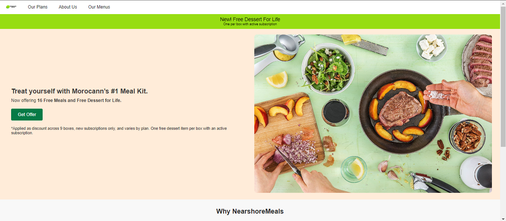
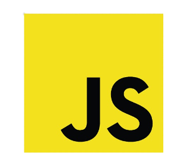
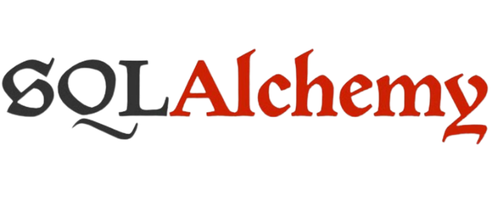

# 🍽️ Meal Kit Portfolio Project : NershorMeals

Welcome to the Meal Kit Portfolio project! This project is designed to showcase a meal kit delivery service application, where users can customize their meal plans, register an account, provide their preferences, and order meals for delivery. The application is hosted at [NershorMeals](http://staycenter.tech/home).

## 📋 Plan

1. [Introduction](#introduction): Brief overview of the project and its objectives.
2. [Home Page](#home-page): Introduction to the application and its features.
3. [Preference Page](#preference-page): Customization of meal plans based on dietary preferences.
4. [Registration Page](#registration-page): Account creation for personalized meal options.
5. [Address Form Page](#address-form-page): Providing delivery details for accurate meal kit delivery.
6. [Checkout Page](#checkout-page): Finalizing orders and reviewing selected meal items.
7. [Meals Page](#meals-page): Exploring a wide variety of meals available for selection.
8. [Web Application Development](#web-application-development): Overview of the technologies used in web application development.

## 🏠 Home Page 

The home page serves as the entry point to the application. Users are greeted with a visually appealing layout that introduces the meal kit service and highlights its key features. The design is modern and inviting, encouraging users to explore further.

## 🍲 Preference Page 

After navigating to the preference page, users can customize their meal plans based on their dietary preferences, allergies, and culinary preferences. The interface is user-friendly, allowing users to select their preferences with ease. This ensures that users receive meals tailored to their tastes and dietary requirements.

## 📝 Registration Page 

To access personalized meal plans and place orders, users are required to register an account. The registration page prompts users to provide their email address and create a secure password. Upon successful registration, users gain access to their account dashboard and personalized meal options.

## 🏢 Address Form Page 

To facilitate meal delivery, users must provide their address details. The address form page allows users to enter their delivery address, ensuring accurate and timely delivery of their meal kits. The form is intuitive and guides users through the process seamlessly.

## 💳 Checkout Page 

Once users have customized their meal plans and provided their address details, they proceed to the checkout page to finalize their orders. The checkout page displays a summary of the selected meal items, allowing users to review their order before completing the purchase. The checkout process is streamlined, enhancing the user experience.

## 🍽️ Meals Page 

The meals page is the heart of the application, where users can explore a wide variety of delicious meals available for selection. Each meal is accompanied by enticing images and detailed descriptions, helping users make informed choices. Users can add meals to their virtual box and save their selections for future reference.

## 🚀 Web Application Development 

The development of the web application was a crucial aspect of building the Meal Kit Portfolio project. Various technologies were utilized to create a seamless user experience and robust functionality. Here are the key technologies used:

- **HTML** : The standard markup language for creating web pages and applications.
- **CSS** : Used for styling and formatting web pages to enhance their appearance.
- **JavaScript** : A versatile programming language used to add interactivity and dynamic behavior to web pages.
- **Python Flask** : A lightweight and flexible micro web framework for backend development.
- **SQLAlchemy** : A powerful SQL toolkit and Object-Relational Mapping (ORM) library for Python, used for database management.
- **jQuery** : A fast, small, and feature-rich JavaScript library for simplifying client-side scripting.
- **MySQL** : A popular open-source relational database management system for storing data efficiently.

These technologies were instrumental in creating a responsive, dynamic, and user-friendly web application for the Meal Kit Portfolio project. Each technology played a crucial role in different aspects of the application, contributing to its overall success.
